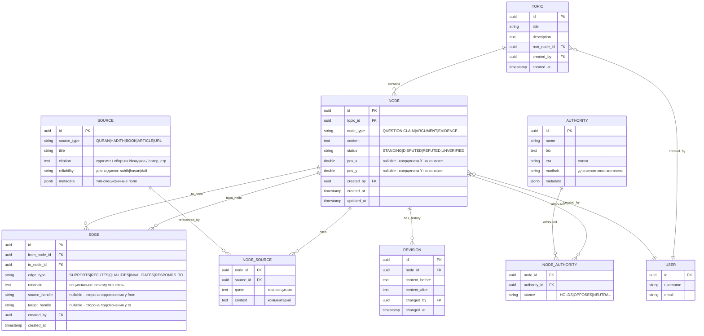

# ER-диаграмма

## Пояснения к связям

- **TOPIC → NODE** (1:N): тема содержит много узлов, но корневой — только один
  (ссылка `root_node_id` в TOPIC).
- **NODE → EDGE** (два 1:N отношения): узел может быть источником и/или
  приёмником многих рёбер.
- **NODE ↔ SOURCE** (M:N через NODE_SOURCE): один узел может цитировать
  несколько источников, один источник — использоваться во многих узлах.
- **NODE ↔ AUTHORITY** (M:N через NODE_AUTHORITY): аналогично, с полем
  `stance` — позиция учёного относительно узла.
- **NODE → REVISION** (1:N): история изменений содержимого узла.

## История изменений схемы

- Поле `NODE.weight` (int 1-10) удалено в миграции 12 (ADR-011) -
  субъективная оценка не использовалась в `StatusCalculation`,
  заменим категориальной разметкой после auth (Stage 6)
- Поля `NODE.pos_x`/`NODE.pos_y` (DOUBLE PRECISION nullable) добавлены
  в миграции 13 (ADR-012) - координаты узла на канвасе для
  Miro-подобного UX, сохраняются при drag-and-drop через
  `PATCH /api/v1/nodes/{id}`
- Поля `EDGE.source_handle`/`EDGE.target_handle` (VARCHAR(20) nullable)
  добавлены в миграции 14 (ADR-013) - id точек подключения ребра
  на сторонах узлов (`top`/`right`/`bottom`/`left`). Сохраняются
  при drag-create в RF, при рендере уважают исходный выбор
  пользователя вместо auto-routing
