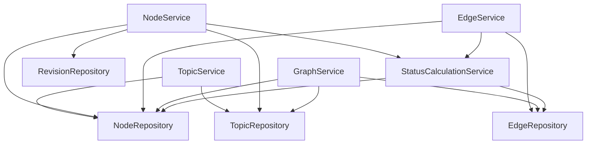

# Дизайн Этапа 3 — сервисный слой

**Дата:** 2026-05-03
**Связанные ADR:** ADR-006 (createdBy через `X-User-Id`), ADR-007 (вклад
типов рёбер в алгоритм пересчёта)
**Связанные документы:** `docs/architecture.md`, `docs/roadmap.md`,
`backend/docs/coding-standards.md`, `backend/docs/testing-strategy.md`

## Цель

Реализовать бизнес-логику над репозиториями Этапа 2: создание/чтение/
изменение тем, узлов, рёбер, ревизий и пересчёт статусов узлов
синхронно при изменениях графа. После этого этапа бэкенд готов к
обвязке REST-контроллерами на Этапе 4.

## Карта зависимостей



**Принципы:**
- Сервисы зависят от репозиториев напрямую. Кросс-сервисные вызовы
  отсутствуют, кроме `EdgeService`/`NodeService → StatusCalculationService`
  для синхронного пересчёта
- `TopicService.createTopic` пишет root-узел через `NodeRepository`
  напрямую: вызов `NodeService.createNode` потребовал бы валидации
  "тема существует", тогда как тема ещё в той же незакоммиченной
  транзакции. Оба репозитория под одной транзакцией — это законно
- `GraphService` не вызывает пересчёт. Статус всегда консистентен,
  потому что пересчёт срабатывает на каждое изменение

## Триггеры пересчёта

| Событие | Триггерит `recalculateTopic`? | Почему |
|---|---|---|
| `EdgeService.createEdge` | да | новое ребро меняет входящий граф цели |
| `EdgeService.deleteEdge` | да | удаление ребра убирает поддержку/опровержение |
| `NodeService.deleteNode` | да | каскадные удаления рёбер по FK |
| `NodeService.updateContent` | нет | content не влияет на статус |
| `NodeService.createNode` | нет | новый узел без рёбер, статус `UNVERIFIED` |
| `TopicService.createTopic` | нет | один узел, нечего пересчитывать |

## Контракты сервисов

```java
// === TopicService ===
@Transactional
Topic createTopic(String title, String description,
                  String rootQuestionContent, UUID userId);
// Создаёт Topic + root Node (QUESTION) + связывает.

@Transactional(readOnly = true)
Topic getTopic(UUID topicId);                    // throws TopicNotFoundException

@Transactional(readOnly = true)
List<Topic> listTopics();

@Transactional
void deleteTopic(UUID topicId);                  // throws TopicNotFoundException


// === NodeService ===
@Transactional
Node createNode(UUID topicId, NodeType type, String content,
                int weight, UUID userId);
// status = UNVERIFIED, timestamps = now. throws TopicNotFoundException.

@Transactional
Node updateContent(UUID nodeId, String newContent, UUID userId);
// Пишет Revision (before/after), обновляет узел. Recalc НЕ триггерится.
// throws NodeNotFoundException.

@Transactional
void deleteNode(UUID nodeId);
// Каскадно удаляет рёбра/revisions/links. Триггерит recalc темы.

@Transactional(readOnly = true)
List<Revision> getRevisions(UUID nodeId);        // throws NodeNotFoundException


// === EdgeService ===
@Transactional
Edge createEdge(UUID fromNodeId, UUID toNodeId, EdgeType type,
                String rationale, UUID userId);
// Валидация: оба узла существуют, в одной теме, fromNodeId != toNodeId.
// Триггерит recalc.
// throws NodeNotFoundException, InvalidEdgeException.

@Transactional
void deleteEdge(UUID edgeId);
// Триггерит recalc темы. throws EdgeNotFoundException.


// === GraphService ===
public record GraphView(Topic topic, List<Node> nodes, List<Edge> edges) {}

@Transactional(readOnly = true)
GraphView getGraph(UUID topicId);                // throws TopicNotFoundException


// === StatusCalculationService (internal) ===
// БЕЗ @Transactional — присоединяется к tx вызывающего сервиса.
void recalculateTopic(UUID topicId);
```

**Что выкинуто (YAGNI):** обновление weight/edge type/rationale,
bulk-операции, full-text поиск (Этап 6).

## Транзакции и исключения

- `@Transactional` — на сервисах. Не на репозиториях, не на контроллерах
  (Этап 4)
- `@Transactional(readOnly = true)` — на чтениях
- `StatusCalculationService` — без аннотации (присоединяется к родительской
  транзакции)

Доменные исключения в `ru.basnukaev.argumentmap.exception/`:
`TopicNotFoundException`, `NodeNotFoundException`, `EdgeNotFoundException`,
`InvalidEdgeException`. Все unchecked, сообщения по-русски.

`DataIntegrityViolationException` от FK-нарушений не отлавливается —
проброс наверх. Маппинг на HTTP — Этап 4 (`@ControllerAdvice`).

## Алгоритм пересчёта статусов

`recalculateTopic(topicId)` — фикспоинт-итерация в памяти, в БД
обновляются только изменившиеся узлы.

```
recalculateTopic(topicId):
  nodes  = nodeRepo.findByTopicId(topicId)
  edges  = edgeRepo.findByTopicId(topicId)
  edgesByTo = group(edges, by toNodeId)
  state  = mutable map<UUID, NodeStatus> { node.id → node.status }

  for iter in 1..MAX_ITERATIONS:
    changed = false
    for node in nodes:
      newStatus = computeStatus(node, edgesByTo[node.id], state)
      if newStatus != state[node.id]:
        state[node.id] = newStatus
        changed = true
    if not changed: break
  if iter == MAX_ITERATIONS:
    log.warn("Пересчёт не сошёлся за {} итераций для темы {}", iter, topicId)

  now = Instant.now()
  for node in nodes:
    if state[node.id] != node.status:
      nodeRepo.updateStatus(node.id, state[node.id], now)
```

`computeStatus(node, incoming, state)`:

```
1. ∃ e ∈ incoming: e.type == INVALIDATES ∧ state[e.fromNodeId] == STANDING
   → return REFUTED   (kill switch — ADR-007)

2. influencing = { e ∈ incoming : e.type ∈ {SUPPORTS, REFUTES} }
   Если influencing пуст → return UNVERIFIED

3. standingSupports = count(e ∈ influencing : e.type == SUPPORTS ∧ state[e.from] == STANDING)
   standingRefutes  = count(e ∈ influencing : e.type == REFUTES  ∧ state[e.from] == STANDING)

4. (standingSupports > 0  ∧ standingRefutes > 0)  → DISPUTED
   (standingSupports > 0  ∧ standingRefutes == 0) → STANDING
   (standingSupports == 0 ∧ standingRefutes > 0)  → REFUTED
   (standingSupports == 0 ∧ standingRefutes == 0) → UNVERIFIED
```

`MAX_ITERATIONS = max(20, nodes.size * 2)`. Защищает от oscillation
в патологических циклах. Не падаем при превышении — warn, оставляем
последнее состояние.

`QUALIFIES`/`RESPONDS_TO` рёбра в `incoming` не отфильтровываются на
вход, но не попадают в `influencing` (ADR-007).

## Тестирование

**Структура:**
- `*IT.java` — integration через Testcontainers
- `StatusCalculationServiceTest.java` — единственный unit-тест
  (с моками `NodeRepository`/`EdgeRepository`). Алгоритм — чистая
  логика, прогон 14 сценариев на Testcontainers замедлит, моки бьют
  точечнее
- Фикстуры — через `jdbcTemplate.update(...)`, не через тестируемые
  сервисы (см. `testing-strategy.md`)

**Сценарии `StatusCalculationServiceTest` (unit):**
1. QUESTION без рёбер → `UNVERIFIED`
2. QUESTION ← CLAIM (`SUPPORTS`), CLAIM=STANDING → CLAIM=`STANDING`
3. CLAIM ← ARG (`REFUTES`) → CLAIM=`REFUTED`
4. CLAIM с STANDING SUPPORTS и STANDING REFUTES → `DISPUTED`
5. Цепочка `A SUPPORTS B SUPPORTS C` → каскад до C
6. A=REFUTED, A SUPPORTS B (только supports B) → B=`UNVERIFIED`
7. `INVALIDATES` kill: meta-arg=STANDING → цель=`REFUTED`
   несмотря на STANDING supports
8. `INVALIDATES` от REFUTED источника игнорируется
9. Цикл `A SUPPORTS B SUPPORTS A` — сходится, без StackOverflow
10. Цикл `A SUPPORTS B, B REFUTES A` — сходится
11. `QUALIFIES` ребро не меняет статус цели
12. `RESPONDS_TO` ребро не меняет статус цели
13. Orphan-узел → `UNVERIFIED`
14. Патологический граф — тест на отсутствие исключений при `MAX_ITERATIONS`

**`StatusCalculationServiceIT` (integration):**
- Один E2E-сценарий через `jdbcTemplate`, проверяет персистентность
- Тест "пересчёт сходится в одной транзакции"

**Прочие `*IT`:**
- `TopicServiceIT.createTopic_createsTopicWithRootQuestion_inOneTransaction`
- `NodeServiceIT.updateContent_writesRevision_withOldAndNewContent`
- `NodeServiceIT.deleteNode_triggersStatusRecalc_forAffectedNodes`
- `EdgeServiceIT.createEdge_rejectsCrossTopic`
- `EdgeServiceIT.createEdge_rejectsSelfLoop`
- `EdgeServiceIT.createEdge_recalcsStatuses`
- `GraphServiceIT.getGraph_returnsAllNodesAndEdges`

**TestGraph builder** — не делаем сейчас. Если фикстурные вызовы в
одном классе перевалят за 6-8 — выделим.

## Файлы

```
backend/src/main/java/ru/basnukaev/argumentmap/
├── exception/
│   ├── TopicNotFoundException.java
│   ├── NodeNotFoundException.java
│   ├── EdgeNotFoundException.java
│   └── InvalidEdgeException.java
└── service/
    ├── TopicService.java
    ├── NodeService.java
    ├── EdgeService.java
    ├── GraphService.java
    ├── StatusCalculationService.java
    └── GraphView.java

backend/src/test/java/ru/basnukaev/argumentmap/
└── service/
    ├── TopicServiceIT.java
    ├── NodeServiceIT.java
    ├── EdgeServiceIT.java
    ├── GraphServiceIT.java
    ├── StatusCalculationServiceIT.java
    └── StatusCalculationServiceTest.java
```

## Порядок реализации

1. Exceptions (`TopicNotFoundException`, `NodeNotFoundException`,
   `EdgeNotFoundException`, `InvalidEdgeException`)
2. `TopicService` + `TopicServiceIT`
3. `NodeService` (без `recalc`-вызова) + `NodeServiceIT` (без recalc-теста)
4. `EdgeService` (без `recalc`-вызова, заглушка) + `EdgeServiceIT` (без recalc)
5. `StatusCalculationService` + `StatusCalculationServiceTest` (unit) +
   `StatusCalculationServiceIT`
6. Подключение SCS в `EdgeService.create/delete` и `NodeService.delete`
7. Recalc-тесты в `EdgeServiceIT` и `NodeServiceIT`
8. `GraphService` + `GraphView` + `GraphServiceIT`

После каждого крупного шага — коммит. После всего — запись в
`progress.md`, проставление `[x]` в `roadmap.md`.

## Открытые вопросы

Нет — всё разрешено через ADR-006/007 и решения, зафиксированные
в `architecture.md`.
